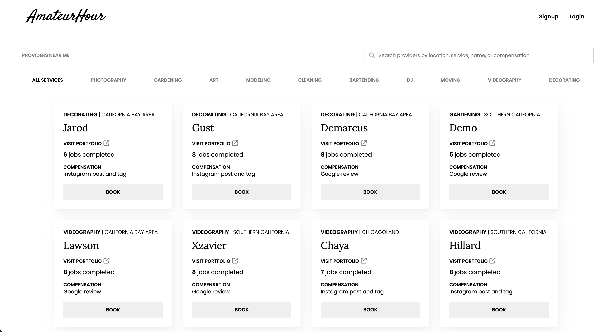

# Amateur Hour

Amateur Hour is a website that allows individuals to gain more cred/experience through porfolio pieces, public reviews, or social media presence to practice their crafts and gain a following.

## Background and overview

It can be near impossible for people who have marketable skills (such as photographers, carpenters, gardeners, etc.) but don't have plenty of reviews on sites like Yelp, followings on social media, or a local presense in their area to break into their respective markets. For beginning skilled folks, Amateur Hour allows them to market their services and skills to clients and customers in exchange for recognition and credit to kickstart their businesses.

To ensure the integrity between provider and client (to avoid the client accepting the provider's services without compensation), the service request flow is:
1. Client requests a service from the provider (job status: "requested")
2. The provider requests the service (job status: "ongoing")
3. The provider marks the job as finished (job status: "pending client compensation")
4. The client loses access to the Amateur Hour features until they compensate the provider and mark their review/post/etc. as complete (job status: "pending provider confirmation")
5. The provider confirms the client's compensation, the client regains access to site (job status: "complete")

## Functionality and MVP

- [ ] User authorization: sign up and login
- [ ] Profile: create and personalize public profiles to advertise skills and how they want to be compensated (i.e. Yelp review, tagged Instagram post...)
- [ ] Services: list all available providers/services 
- [ ] Service request flow
- [ ] User dashboard: view your requests, job requests, and ongoing jobs
- [ ] Production README.md

**Bonus features**
- [ ] Search services

## Technologies

- MongoDB - NoSQL backend database
- Express - backend Node.js web application framework
- React - JavaScript library for frontend components
- Node.js - backend JavaScript runtime environment

## Group members and work breakdown

Julia Kahn (frontend), Shannon Millar (backend), Mitchell Chan & Davis Lucky

