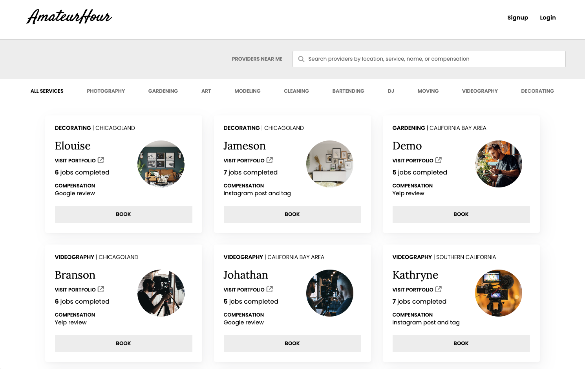
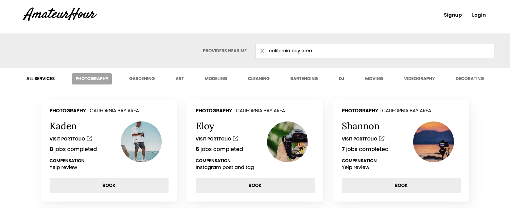
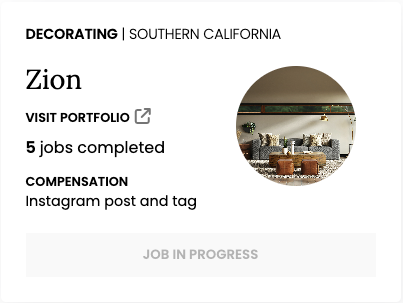
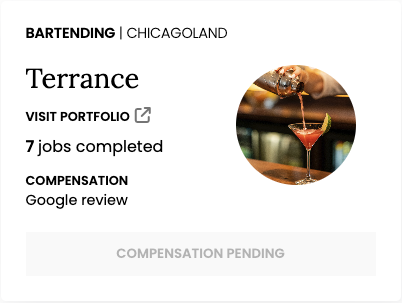
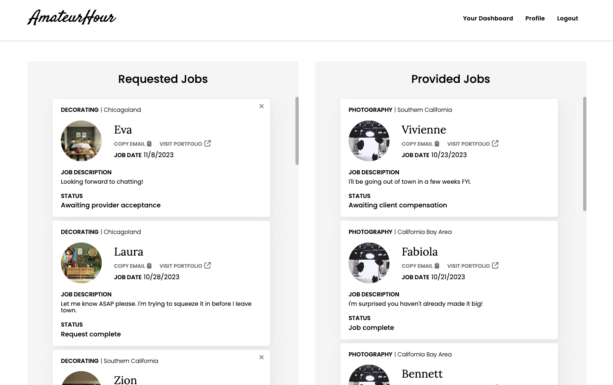
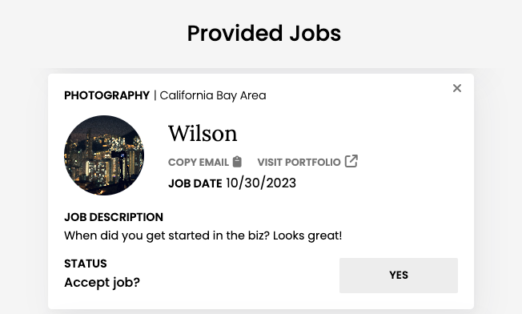
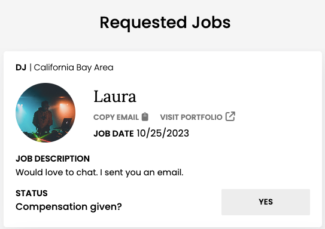
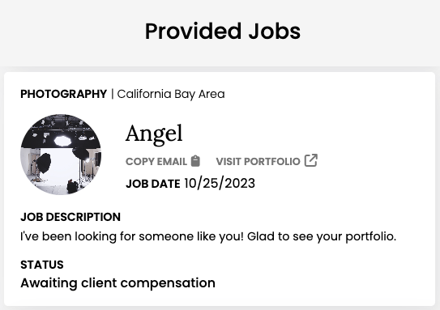

# Amateur Hour

[](https://amateur-hour.onrender.com/)


Amateur Hour is a platform that allows individuals to gain more cred/experience through porfolio pieces, public reviews, or social media presence to practice their crafts and gain a following.



## Background and overview

It can be near impossible for people who have marketable skills (such as photographers, carpenters, gardeners, etc.) but don't have plenty of reviews on sites like Yelp, followings on social media, or a local presense in their area to break into their respective markets. For beginning skilled folks, Amateur Hour allows them to market their services and skills to clients in exchange for recognition and credit to kickstart their businesses.

Users may browse the available services by provider (e.g., name, location) or by service (e.g., category, compensation method). Once they log in and find a service provider they want to book, they become a client of that provider and enter the following flow:

1. A client requests a job from a provider
2. The provider can accept or decline the request; if accepted, proceed
3. Once the job is finished, the provider marks the job as completed
4. Once the client compensates the provider, they mark the job compensation as completed. To ensure service integrity, the client is unable to request new jobs until all their requested jobs have been compensated
5. Once the provider confirms compensation from the client, the client regains the ability to make new requests

## Technologies

- MongoDB - NoSQL backend database
- Express - backend Node.js web application framework
- React - JavaScript library for frontend components
- Node.js - backend JavaScript runtime environment
- AWS S3 - cloud storage for site images

## Key Features 

### Service Index

Logged in users can request jobs from any of the provides on the Service Index, where they can filter on various service details:


Service category filters are readily available can be used in conjunction with the search bar (e.g., photography services in 'california bay area'):



Clients may have as many requested jobs as they like; however, they may not request multiple jobs from the same provider at one time, nor can they request new jobs while having any pending their compensation to providers:

 

#### Supporting Code Sample
```javascript
if (cannotRequestNewJob) {
bookButton = (<button className="service-item-button booked" disabled>compensation pending</button>);
} else {
jobs.some(job => job.client._id === currentUser?._id) ?
    bookButton = (<button className="service-item-button booked" disabled>job in progress</button>) :
    bookButton = (<button className="service-item-button" onClick={handleClick}>Book</button>);
}
```

### Job Dashboard

Logged in users can manage their requested jobs (as a client) as well as their provided jobs (as a provider) in their Job Dashboard:



The displayed job status will differ between requested jobs and provided jobs:


and provided jobs:



Jobs may be cancelled by either a client or provider, unless it has been confirmed complete by the client and is pending compensation for the provider: 




#### Supporting Code Sample
```javascript
{statusIndex < 3 ?
    <div className="job-item-delete" onClick={handleDeleteModal}>
        <i className="fa-solid fa-xmark"></i>
    </div> : <></>
}
```